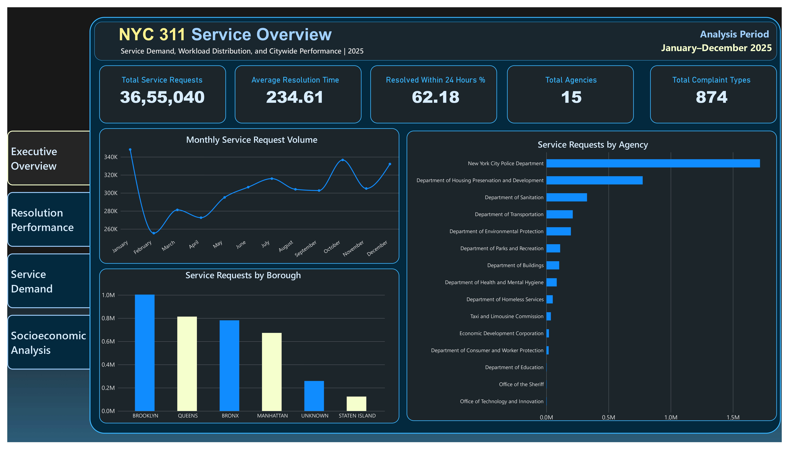
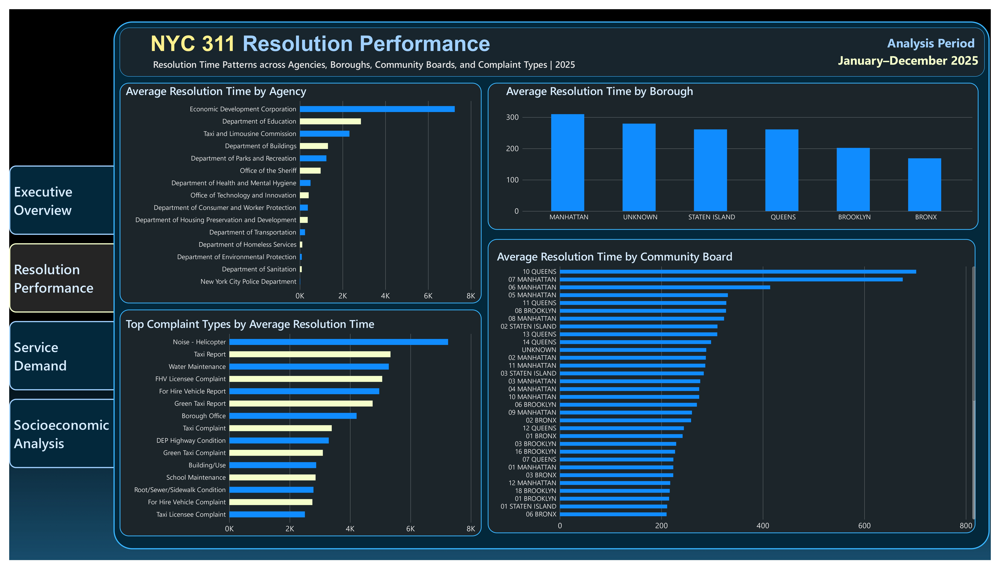
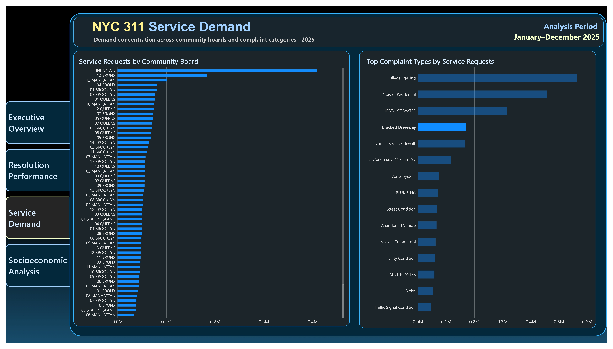
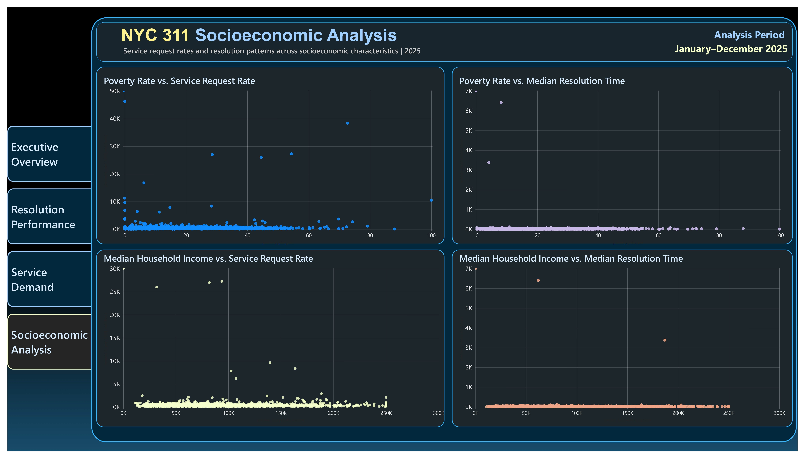

# NYC Urban Infrastructure & Service Analytics

A data analytics project analyzing 3.65 million NYC 311 service requests from 2025 to understand service demand, agency workload, resolution performance, geographic variation, and relationships with socioeconomic characteristics.

## Project Overview

Municipal service request data can provide useful insights into how residents interact with city services and how requests are distributed across agencies, complaint types, and neighborhoods.

This project analyzes NYC 311 service requests for the full 2025 calendar year and combines:

* Python-based data cleaning and validation
* Geospatial analysis
* U.S. Census socioeconomic data
* MySQL analysis
* Power BI dashboard development

The analysis focuses on observed patterns in service demand and resolution performance. It does not infer causality from correlations or geographic differences.

## Key Questions

* How does NYC 311 service demand change throughout the year?
* Which agencies receive the highest number of service requests?
* Which complaint types account for the largest share of requests?
* How does resolution performance vary across agencies and boroughs?
* How does service demand vary across community boards?
* What relationships exist between service request rates and socioeconomic characteristics?

## Dataset

The analysis covers:

* **Analysis period:** January–December 2025
* **Service requests:** 3,655,040
* **Agencies:** 15
* **Complaint types:** 874
* **Community boards:** 59
* **Boroughs:** 5
* **Valid resolution records:** 3,525,111
* **Average resolution time:** 234.61 hours
* **Resolved within 24 hours:** 62.18%

### Data Sources

* NYC OpenData — 311 Service Requests
* U.S. Census Bureau — American Community Survey (2024 5-Year)
* U.S. Census Bureau — TIGER/Line geographic data
* NYC geographic boundary data

The full processed dataset is not included in this repository because of its large file size. See [`data/README.md`](data/README.md) for details.

## Tools & Technologies

| Tool         | Purpose                                           |
| ------------ | ------------------------------------------------- |
| Python       | Data cleaning, validation, profiling and analysis |
| Pandas       | Data manipulation                                 |
| GeoPandas    | Geospatial analysis                               |
| MySQL        | SQL analysis and aggregation                      |
| Power BI     | Interactive dashboard development                 |
| Google Colab | Python analysis environment                       |
| GitHub       | Project documentation and version control         |

## Project Workflow

```text
NYC 311 Data
     ↓
Data Recovery & Cleaning
     ↓
Data Profiling & Validation
     ↓
Geospatial Analysis
     ↓
Socioeconomic Analysis
     ↓
MySQL Analysis
     ↓
Power BI Preparation
     ↓
Dashboard & Key Findings
```

## Dashboard Preview

### Executive Overview



### Resolution Performance



### Service Demand



### Socioeconomic Analysis



## Analysis Areas

### Service Demand

The analysis examines:

* Monthly service request trends
* Agency workload
* Complaint type concentration
* Borough-level demand
* Community board demand

### Resolution Performance

The analysis examines:

* Average resolution time
* Percentage of requests resolved within 24 hours
* Agency-level resolution performance
* Borough-level resolution performance
* Community board resolution performance
* Complaint-type resolution performance

Because resolution time is right-skewed, both average resolution time and the percentage resolved within 24 hours are used to provide additional context.

### Socioeconomic Analysis

The project integrates Census tract-level socioeconomic indicators to examine relationships between:

* Poverty rate and service request rate
* Median household income and service request rate
* Poverty rate and resolution time
* Median household income and resolution time

These relationships are descriptive associations and should not be interpreted as causal effects.

## Key Findings

### Service Demand

NYC recorded **3,655,040 service requests** during 2025.

The largest agency workloads were associated with:

* New York City Police Department
* Department of Housing Preservation and Development
* Department of Sanitation
* Department of Transportation
* Department of Environmental Protection

### Complaint Types

The largest complaint categories included:

* Illegal Parking
* Noise - Residential
* HEAT/HOT WATER
* Blocked Driveway
* Noise - Street/Sidewalk

### Resolution Performance

Resolution times vary substantially across agencies and complaint types.

Some high-volume complaint categories have relatively short average resolution times, while other categories have substantially longer resolution periods.

Resolution time is strongly right-skewed, so average resolution time can be influenced by long-running cases.

### Socioeconomic Analysis

At the Census tract level, the analysis found relatively weak associations between socioeconomic characteristics and service request rates.

Examples include:

* Request rate vs. poverty rate: Spearman correlation ≈ **0.171**
* Request rate vs. median household income: Spearman correlation ≈ **-0.126**

These relationships should not be interpreted as causal effects. They are descriptive associations at the Census tract level and may be influenced by factors such as population characteristics, reporting behavior, service type, and agency workflows.

## Methodology

The project followed these main stages:

1. Recovered and combined monthly NYC 311 data.
2. Profiled the raw dataset.
3. Cleaned dates, agencies, statuses, complaint types, and geographic fields.
4. Validated records and geographic information.
5. Calculated resolution duration metrics.
6. Assigned coordinate-valid requests to Census tracts.
7. Integrated ACS socioeconomic indicators.
8. Applied a population threshold of 1,000 residents for sensitivity analysis.
9. Performed SQL analysis using MySQL.
10. Prepared analytical tables for Power BI.
11. Built a four-page Power BI dashboard.
12. Documented key findings and limitations.

## Limitations

* 311 requests represent reported service needs, not all conditions occurring across the city.
* Resolution time varies by complaint type and agency workflow.
* Resolution time is highly right-skewed, so averages can be influenced by long-running cases.
* Socioeconomic analysis is conducted at the Census tract level and should not be interpreted as individual-level relationships.
* Correlation does not establish causation.
* Some geographic and socioeconomic fields have incomplete coverage.
* Low-volume complaint categories can produce unstable average resolution times.
* Differences in service request volume may reflect reporting behavior and service composition in addition to underlying conditions.

## Project Status

**Completed**

The project includes the analytical workflow from data recovery and validation through geospatial and socioeconomic analysis, SQL analysis, Power BI dashboard development, and documented findings.
